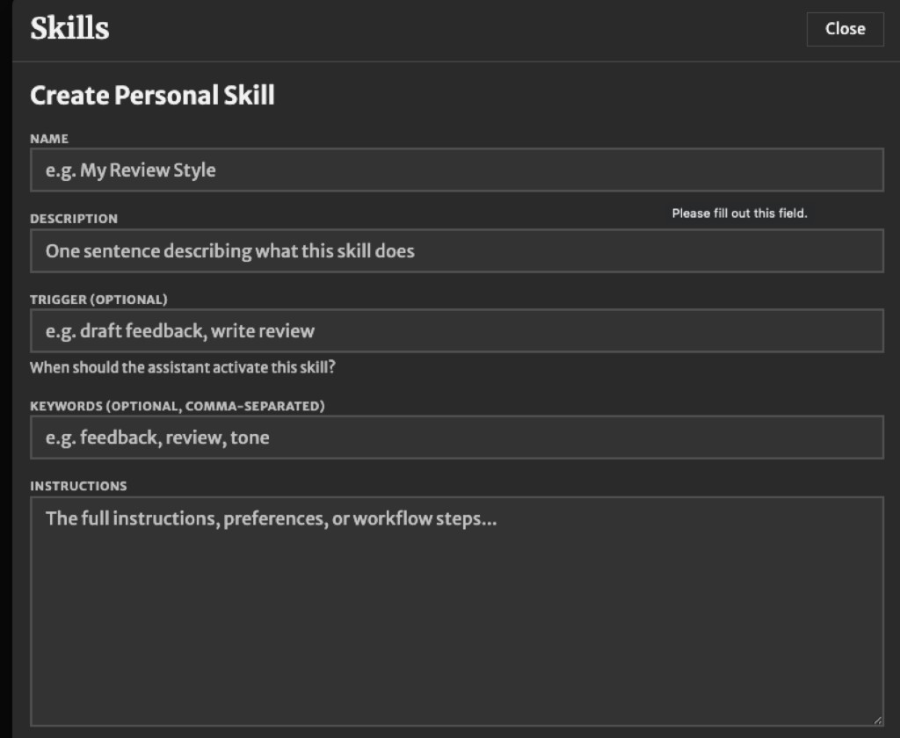

# Installing skills on each platform

Every skill in this repo is a single `SKILL.md` file. What changes between platforms is where you put it, or which box you paste it into.

If you have not downloaded the skills yet, start with [sharing-with-github.md](sharing-with-github.md).

## Claude Code and Claude Cowork

Install the prebuilt package. Each file in [`skills/packaged/`](../skills/packaged/) is a `.skill` file, which is just the skill zipped up.

1. Download the `.skill` file for the skill you want. On GitHub, open the file and click Download.
2. In Claude, open Settings, find Skills, and install the downloaded file.
3. Repeat for each skill you want. There is no bundle install; skills go in one at a time.

If you work from a clone of this repo, you can instead point Claude Code at the `skills/` directory and skip the packages entirely.

Cowork users: paste the team's always-on guardrails into Admin, Capabilities, Organization instructions. Those cover FERPA, secrets, repo tiers, and the design system, and they apply to every conversation. Do not copy them into individual skills.

## Cursor

Cursor reads the same file format from a skills folder.

- Personal skills: copy the whole `skills/<name>/` folder into `~/.cursor/skills/`.
- Project skills: copy it into `.cursor/skills/` inside the project.

No packaging step. Cursor picks up the folder on its own.

## eLC / D2L Brightspace ID Assistant

The ID Assistant has a form instead of a file. Open Skills, then Create Personal Skill.

Fill it from the SKILL.md file:

- **Name** — the frontmatter `name`, or the friendly title from the `#` heading
- **Description** — the frontmatter `description`
- **Trigger** — the frontmatter `trigger`, if the skill has one; otherwise leave blank
- **Keywords** — the frontmatter `keywords`, if the skill has any; otherwise leave blank
- **Instructions** — everything below the closing `---`, pasted as-is

Do not paste the `---` block itself into Instructions.

Two things to know. First, the ID Assistant runs inside eLC and cannot open files in a repository, so skills that scaffold code or read repo paths (`elc-agent-scaffolder`, `scaffold-from-uga-online-template`, `uga-online-pr-reviewer`) will not work there. Use those in Claude Code or Cursor. Second, the ID Assistant is a different thing from the custom AI agents embedded in eLC courses. This repo does not manage those.

## ChatGPT, Copilot, Gemini, and anything else

These do not have a skill system, but the file still works. Paste everything below the frontmatter into a custom instruction, a project file, or the first message of a conversation. The frontmatter is metadata for other platforms; it does nothing here, so leave it out.

Because there is no automatic triggering, tell the assistant plainly what you want at the start: "Using the instructions above, clean up the HTML in this file."

## Where the guardrails go

FERPA rules, secret handling, repo tiers, and the design system apply to all work, not one task. Put them in the platform's always-on setting rather than repeating them in each skill:

- Cowork: Organization instructions
- Cursor: a rule with `alwaysApply: true`
- ChatGPT and similar: custom instructions or project instructions

Skills should carry only the limits specific to their own job.
