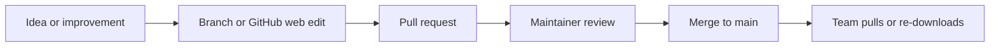

# Using GitHub to share skills

This repo is the single place our team's AI skills live. Everyone pulls from it, everyone contributes back to it, and nobody has to email a text file around.

If you have never used GitHub, read the glossary at the bottom first. Nothing here requires you to install anything.

## Why one repo instead of sharing files

Three problems come from passing skills around by email or chat. People end up on different versions and get different results. Improvements one person makes never reach anyone else. And there is no record of why a skill says what it says.

A repo fixes all three. There is exactly one current version of each skill on the `main` branch, changes arrive through pull requests that someone reviews, and the history explains itself.

## Getting the skills

Pick whichever matches how you work.

**Download once (no tools needed).** On the repo's GitHub page, click the green Code button and choose Download ZIP. Unzip it and follow [platforms.md](platforms.md) to install what you want. To get updates later, download a fresh ZIP.

**Clone (stays current).** If you have git:

```bash
git clone https://github.com/uga-ool/uga-online-ai-skills.git
```

Then `git pull` whenever you want the latest. This is worth it if you install more than a couple of skills, because updating is one command instead of a re-download.

**Grab a single skill.** Open `skills/<name>/SKILL.md` on GitHub and copy the text, or open `skills/packaged/<name>.skill` and click Download. Fine for one-offs.

## Staying current

Skills change as the team learns what works. Watch the repo on GitHub (the Watch button, set to Releases or All Activity) to get notified, or check back occasionally and re-download.

When a skill you have installed changes, reinstall it. Platforms do not auto-update from the repo. In Claude that means installing the new `.skill` file over the old one; in Cursor, copying the folder again; in the ID Assistant, editing the skill and pasting the new instructions.

## Contributing back

Two ways in, both ending at the same place. Full instructions are in [CONTRIBUTING.md](../CONTRIBUTING.md).

If you have a skill that works well for you, share it. Copy [`templates/skill-template/SKILL.md`](../templates/skill-template/SKILL.md), fill it in, and open a pull request. You do not need to know git; GitHub's website can do the whole thing.

If you want a skill but do not want to write it, open an issue using the "Request a new skill" template. Describe the task and what a good result looks like, and someone will build it.

If an existing skill misbehaves, open an issue using the "Report a skill problem" template. Include what you asked for and what you got.

## How changes get in



Nothing goes onto `main` without a pull request, and every pull request gets read by someone other than the author. That review is not a gate to slow you down; it is mostly checking that the skill has a good description, does not duplicate an existing one, and contains no student data or credentials.

## Ground rules

Never commit student names, UGA IDs, grades, API keys, tokens, or passwords. Skills are shared with the whole team and the repo history keeps everything, so a mistake here is hard to undo. If you catch one, say so immediately rather than quietly deleting the line.

Write skills that would make sense to a colleague who was not in the conversation that prompted them.

## Glossary

**Repository (repo)** — A folder of files that GitHub stores and tracks. This one holds our skills.

**Clone** — Your own copy of the repo on your computer, connected to the one on GitHub.

**Branch** — A parallel set of changes with a name, so your work in progress does not disturb what everyone else is using. `main` is the branch everyone installs from.

**Commit** — One saved change, with a short message saying what it was.

**Pull request (PR)** — A proposal to merge your branch into `main`. It shows exactly what would change and gives people a place to comment before it happens.

**Merge** — Accepting a pull request, which puts your change into `main` where the team gets it.

**Issue** — A conversation about a bug or a request. No code required.
